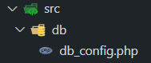
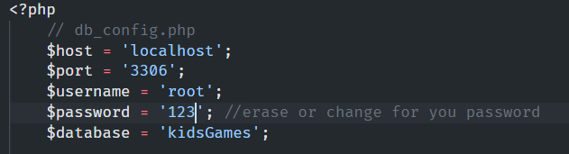
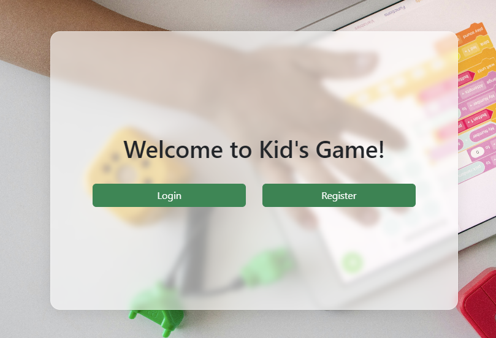
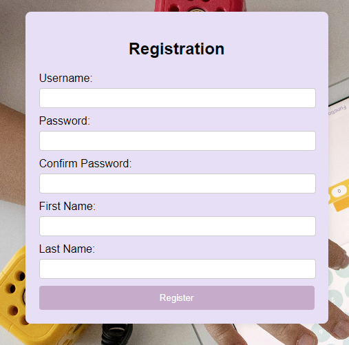
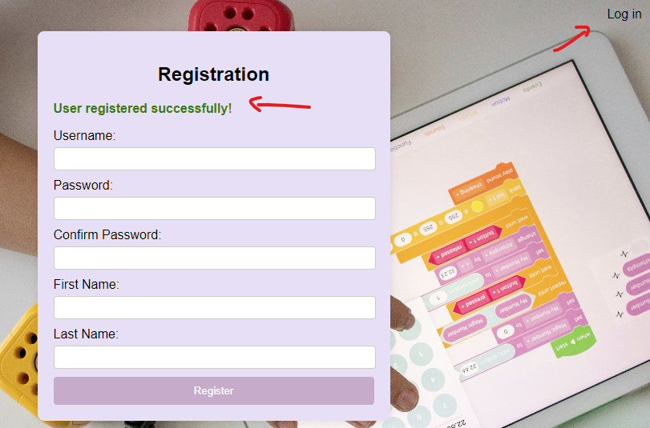
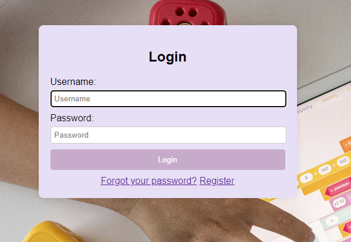
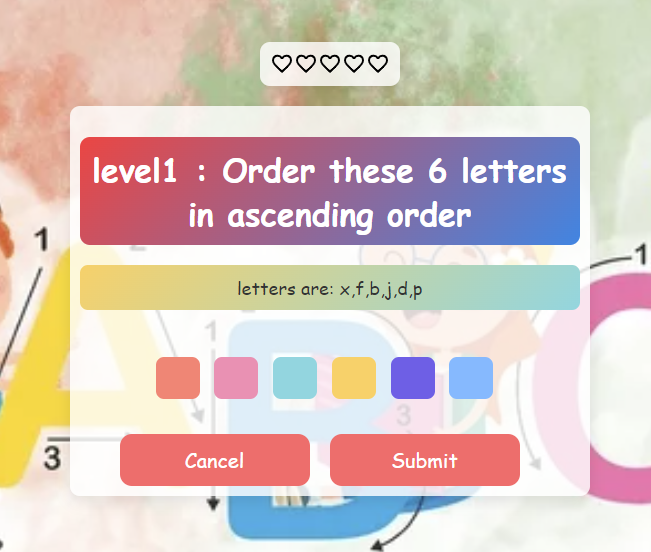

# DW3_Final_Project

# how to use it?
To run this project you will need:
- a PHP environment (XAMPP | MAMPP | WAMPP)
- a MySql Database 

## Setting up
To run this project you will need a database with the same structure providade by the professor.

Inside the project "src>db>db_config.php" you will find and be able to set your on DB information:

Probably you will just have to adjust the password:

# Running the application
1 - To test the application you can copy and past the project files inside your (XAMPP | MAMPP | WAMPP) folder and access this address on your browser: http://localhost/dw3_final_project/

2 - Create a user:
2.1 - click on registration button:

2.2 - Inform your data:

2.3 - Click on "Register" 

2.4 - After receiving the confirmation message, you can click on "login"

3 - Inform your username and password:

4 - If you enter the right credential, the game will start:

